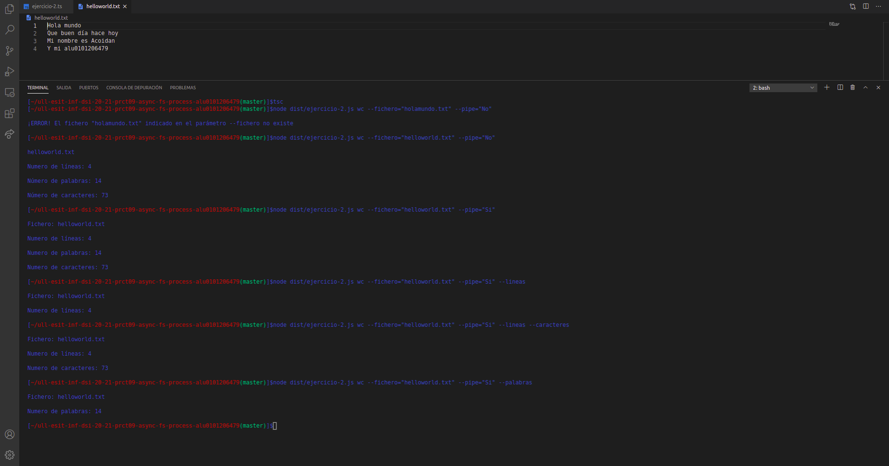
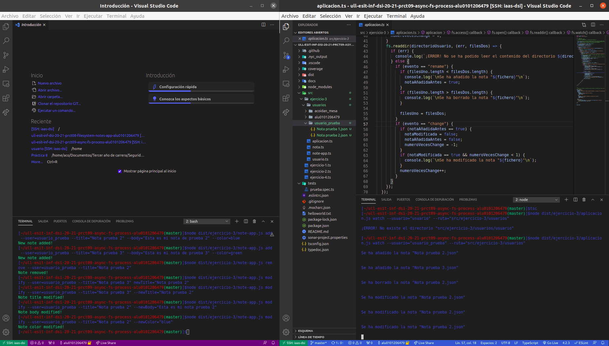
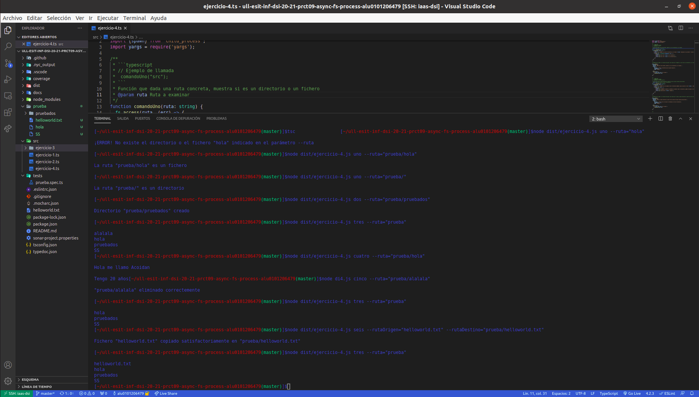

# Informe
## Práctica 9 - Sistema de ficheros y creación de procesos en Node.js
### Desarrollo de Sistemas Informáticos
### ACOIDAN MESA HERNANDEZ - alu0101206479@ull.edu.es


#### Introducción
Esto es un informe para poder llevar a cabo la **práctica 9 de Desarrollo de Sistemas Informáticos**, hemos vuelto a crear una estructura de directorios adecuada (algo que ya sabíamos de prácticas anteriores), añadiendole el uso del generador de documentación [TypeDoc](https://typedoc.org/) y el uso de [Mocha](https://mochajs.org/) (Marco de pruebas rico en funciones) con [Chai](https://www.chaijs.com/) (Librería de aserciones BDD / TDD para node y el navegador que se puede combinar con cualquier marco de pruebas JS o TS, en este caso lo hemos configurado con Mocha). También hemos añadido [Instanbul](https://istanbul.js.org/) (Una herramienta que permite obtener informes sobre el cubrimiento del código fuente llevado a cabo por las pruebas que haya diseñado), hemos aplicado la integración continua mediante [GitHub Actions](https://docs.github.com/en/actions) (permite crear flujos de trabajo que se pueden utilizar para compilar, probar y desplegar código, dando la posibilidad de crear flujos de integración y despliegue continuo dentro del propio repositorio de git) y hemos aplicado la comprobación de la calidad y seguridad del código fuente mediante [Sonar Cloud](https://sonarcloud.io/) (Plataforma de análisis de código continuo y online con la que puedes analizar tus proyectos y ver los resultados online en la nube) y GitHub Actions

Hemos vuelto a **trabajar con ficheros, a través de la [API de callbacks proporcionada por Node.js para interactuar con el sistema de ficheros](https://nodejs.org/dist/latest/docs/api/fs.html#fs_callback_api)**, a usar el paquete **[yargs](https://www.npmjs.com/package/yargs)** y hemos aprendido a trabajar con la **creación de procesos de Node.js, a través de la [API asíncrona proporcionada por Node.js para crear procesos](https://nodejs.org/dist/latest/docs/api/child_process.html#child_process_asynchronous_process_creation)**, en concreto, con la función [`spawn`](https://nodejs.org/dist/latest/docs/api/child_process.html#child_process_child_process_spawn_command_args_options). En este informe se mostrarán la resolución de los ejercicios y la explicación de estas soluciónes.

También cabe destacar que hemos usado de nuevo los [issues de Github](https://guides.github.com/features/issues/), ya que era por dónde único podríamos comunicarle al profesorado cualquier tipo de incidencia relacionada con la práctica.


#### Objetivos
Los objetivos de esta práctica han sido crear la estructura de directorios adecuada para trabajar, añadiendole el generador de documentación TypeDoc, el uso del marco de pruebas Mocha con la libreria Chai y Instanbul para obtener un informe de cubrimiento de nuestro código cada vez que ejecutasemos las pruebas.También debimos aplicar la integración continua mediante GitHub Actions y aplicar la comprobación de seguridad y calidad del código mediante SonarCloud y GitHub Actions, aparte de usar el paquete yargs de nuevo. Pero lo principal ha sido resolver los 4 ejercicios que nos planteaban en el [enunciado](https://ull-esit-inf-dsi-2021.github.io/prct09-async-fs-process/), para así familiarizarnos más profundamente con TypeScript, en concreto con el sistema de ficheros y con la creación de procesos.


#### Crear la estructura básica y adecuada del proyecto, añadiendole el generador de documentación TypeDoc, el uso del marco de pruebas Mocha con la librería Chai, la herramienta Instanbul, la aplicación de GitHub Actions y la aplicación de SonarCloud
Para crear la [estructura básica del proyecto](https://ull-esit-inf-dsi-2021.github.io/typescript-theory/typescript-project-setup.html), lo haremos como lo hicimos en prácticas anteriores (Estará el enlace al informe de esta en la bibliografía), también podemos pinchar el hiperenlace adjuntado que se encontrará disponible también en la bibliografía. También cabe destacar que todos los extras que le añadimos a la estructura básica los haremos como lo hicimos en la [práctica anterior](https://ull-esit-inf-dsi-2021.github.io/ull-esit-inf-dsi-20-21-prct08-filesystem-notes-app-alu0101206479/).

Finalmente, nos tiene que quedar algo parecido a lo siguiente (Se muestra a la izquierda la estructura y en el medio algunos archivos abiertos para que se vea su interior):


#### Ejercicios
En cuanto a los ejercicios que se mostrarán a continuación, podemos ver sus respectivos enunciados [en el enunciado de la práctica 9](https://ull-esit-inf-dsi-2021.github.io/prct09-async-fs-process/). El código fuente de estos ejercicios deberá estar alojado en un fichero independiente con nombre `ejercicio-n.ts` dentro del directorio `src/` de nuestro proyecto (Excepto el ejercicio 3, que estará en el directorio `ejercicio-3` dentro de `src/`).

Cabe destacar que también se debe aportar la documentación mediante el uso de TypeDoc.


##### Ejercicio 1
En este ejercicio disponiamos de un código de ejemplo el cual es el siguiente:

```typescript
import {access, constants, watch} from 'fs';

if (process.argv.length !== 3) {
  console.log('Please, specify a file');
} else {
  const filename = process.argv[2];

  access(filename, constants.F_OK, (err) => {
    if (err) {
      console.log(`File ${filename} does not exist`);
    } else {
      console.log(`Starting to watch file ${filename}`);

      const watcher = watch(process.argv[2]);

      watcher.on('change', () => {
        console.log(`File ${filename} has been modified somehow`);
      });

      console.log(`File ${filename} is no longer watched`);
    }
  });
}
```

Y debíamos realizar la traza de ejecución de dicho programa mostrando paso a paso el contenido de la pila de llamadas, el registro de eventos de la API y la cola de manejadores de Node.js, además de lo que se muestra por la consola. Y debíamos para ello simular que se llevan a cabo dos modificaciones del fichero helloworld.txt a lo largo de la ejecución del programa. Dicha traza la podremos ver comentada debajo del código en el siguiente enlace:

  [https://github.com/ULL-ESIT-INF-DSI-2021/ull-esit-inf-dsi-20-21-prct09-async-fs-process-alu0101206479/blob/master/src/ejercicio-1.ts](https://github.com/ULL-ESIT-INF-DSI-2021/ull-esit-inf-dsi-20-21-prct09-async-fs-process-alu0101206479/blob/master/src/ejercicio-1.ts)
  
En cuanto a la resolución de las preguntas que nos plantea el enunciado, las respuestas son las siguientes:

* ¿Qué hace la función access?
La función access prueba los permisos de un usuario para el archivo o directorio especificado en la ruta que se le pasa a la función

* ¿Para qué sirve el objeto constants?
El objeto constants sirve para realizar las operaciones del sistema de archivos, ya que contiene las constantes de uso común en estas. Por ejemplo, la constante F_OK (fs.constants.F_OK), sirve para comprobar en la función fs.access() que el archivo es visible para el proceso de llamada


##### Ejercicio 2
En este ejercicio disponemos de dos funciones:
  * `function funcionConPipe(opciones: string[], fichero: string)`: Es una función que proporciona información sobre el número de líneas, palabras o caracteres que contiene un fichero de texto haciendo uso del método pipe de un Stream. A esta función se le pasa por parámetro las opciones, que es un vector de string que determina con lo que se quiere contar, por ejemplo si se introduce el vector `["lineas", "caracteres"]`, significa que queremos contar las líneas y los caracteres del fichero que le indiquemos en el segundo parámetro.
  * `funcion funcionSinPipe(opciones: string[], fichero: string)`: Es una función que proporciona información sobre el número de líneas, palabras o caracteres que contiene un fichero de texto sin hacer uso del método pipe de un Stream. A esta función se le pasa por parámetro las opciones, que es un vector de string que determina con lo que se quiere contar, por ejemplo si se introduce el vector `["lineas", "caracteres"]`, significa que queremos contar las líneas y los caracteres del fichero que le indiquemos en el segundo parámetro.

Y como teníamos que usar **yargs** para gestionar el paso de parámetros desde la línea de comandos a la aplicación, pues tenemos el comando:
  * `wc`: Es un comando que sirve para contar el número de líneas, palabras o caracteres que contiene un fichero de texto el cual pasamos por parámetros (`--fichero="helloworld.txt`). También cabe destacar que a parte del fichero, a este comando como parámetro obligatorio se le pasa pipe, el cual indica si quiere hacer uso de la función que utiliza `pipe` o la que no (`--pipe="Si"` o `--pipe="No"`). Y como parámetros opcionales hay tres booleanos, que sirven para que el usuario indique que quiere contar las líneas (`--lineas`), las palabras(`--palabras`), los caracteres (`--caracteres`), o incluso, combinaciones entre estas opciones(`--lineas --caracteres`). Si no se introducen ninguno de los parámetros opcionales, se contarán tanto las líneas, como las palabras y los caracteres.

El código de este ejercicio lo podremos encontrar en el siguiente enlace:

  [https://github.com/ULL-ESIT-INF-DSI-2021/ull-esit-inf-dsi-20-21-prct09-async-fs-process-alu0101206479/blob/master/src/ejercicio-2.ts](https://github.com/ULL-ESIT-INF-DSI-2021/ull-esit-inf-dsi-20-21-prct09-async-fs-process-alu0101206479/blob/master/src/ejercicio-2.ts)
  
Y en la siguiente imagen se muestra un ejemplo de ejecución de la aplicación desarrollada en el ejercicio (Para compilar se usa `tsc` y para ejecutar `node dist/ejercicio-2.js wc --fichero="X" --pipe="Si o no" --parametrosOpcionales`:




##### Ejercicio 3
En este ejercicio se debe copiar la aplicación de notas de la [práctica anterior](https://ull-esit-inf-dsi-2021.github.io/ull-esit-inf-dsi-20-21-prct08-filesystem-notes-app-alu0101206479/) (Por esta misma razón este ejercicio tiene un directorio para si mismo y no un único fichero con extensión `.ts` como los demás ejercicios), y a partir de aqui desarrollar una aplicación (La cual se almacena en el fichero `src/ejercicio-3/aplicacion.ts`), que controle los cambios realizados sobre todo el directorio del usuario mientras en otra terminal se interactúa con la aplicación de notas. Esta aplicacion está compuesta por la funcion:
  * `function aplicacion(usuario: string, ruta: string)`: Es una función que a través de la función `fs.watch()` se controlan los cambios realizados sobre todo el directorio especificado al mismo tiempo que el usuario interactúa con la aplicación de procesamiento de notas. A esta función le entra como parámetro el usuario de la aplicación de notas al que queremos controlarle el directorio y la ruta dónde se almacenan los directorios de los usuarios (Esta ruta en nuestro caso es `src/ejercicio-3/usuarios/`). Cabe destacar también que en esta función se desarrollan diversas comprobaciones de errores con funciones como `fs.access()`, `fs.open`, etc y se usan variables auxiliares para que los mensajes se muestren adecuadamente (Un mensaje si se elimina un fichero, un mensaje si se añade un fichero y un mensaje si se modifica un fichero)

Y como teníamos que usar **yargs** para gestionar el paso de parámetros desde la línea de comandos a la aplicación, pues tenemos el comando:
  * `watch`: Es un comando que sirve para controlar el directorio del usuario que le pasemos por parametro (`--usuario="alu0101206479"`) indicandole tambien por parámetro la ruta donde se almacena el directorio de este usuario (En nuestro caso siempre será `--ruta="src/ejercicio-3/usuarios"`).

El código de la aplicación de este ejercicio lo podremos encontrar en el siguiente enlace:

  [https://github.com/ULL-ESIT-INF-DSI-2021/ull-esit-inf-dsi-20-21-prct09-async-fs-process-alu0101206479/blob/master/src/ejercicio-3/aplicacion.ts](https://github.com/ULL-ESIT-INF-DSI-2021/ull-esit-inf-dsi-20-21-prct09-async-fs-process-alu0101206479/blob/master/src/ejercicio-3/aplicacion.ts)
  
Y en la siguiente imagen se muestra un ejemplo de ejecución de la aplicación desarrollada en el ejercicio (Para compilar se usa `tsc` y para ejecutar `node dist/ejercicio-3/aplicacion.js watch --usuario="X" --ruta="src/ejercicio-3/usuarios"`) mientras se interactúa con la aplicación de notas (A la izquierda el uso de la aplicación de notas, a la derecha la aplicación creada para este ejercicio):




##### Ejercicio 4
En este ejercicio se debía hacer una aplicación que hiciera de **wrapper** de los distintos comandos empleados en Linux para el manejo de ficheros y directorios, esta aplicación dispondrá de las siguientes funciones:
  * `function comandoUno(ruta: string)`: Función que dada una ruta concreta pasada como parámetro, muestra si es un directorio o un fichero.
  * `function comandoDos(ruta: string)`: Función que crea un nuevo directorio a partir de una ruta que recibe como parámetro.
  * `function comandoTres(ruta: string)`: Función que lista los ficheros dentro de un directorio cuya ruta es pasada por parámetros.
  * `function comandoCuatro(ruta: string)`: Función que muestra el contenido de un fichero cuya ruta recibe por parámetros
  * `function comandoCinco(ruta: string)`: Función que borra ficheros y directorios cuya ruta recibe por parámetros
  * `comandoSeis(rutaOrigen: string, rutaDestino: string)`: Función que mueve y copia ficheros y/o directorios de una ruta a otra, estas rutas son pasadas por parámetros

Y como teníamos que usar **yargs** para interactuar con la aplicación a través de la línea de comandos, pues tenemos los comandos:
  * `uno`: Es un comando que representa el punto 1 del ejercicio 4 (Muestra si una ruta es un directorio o un fichero) y a este comando se le pasa como parámetro la ruta (`--ruta="src"`)
  * `dos`: Es un comando que representa punto 2 del ejercicio 4 (Crea un nuevo directorio a partir de una ruta) y a este comando se le pasa como parámetro la ruta (`--ruta="src/ejercicio-3/usuarios/prueba"`)
  * `tres`: Es un comando que representa punto 3 del ejercicio 4 (Lista los ficheros dentro de un directorio) y a este comando se le pasa como parámetro la ruta (`--ruta="src"`)
  * `cuatro`: Es un comando que representa punto 4 del ejercicio 4 (Muestra el contenido de un fichero) y a este comando se le pasa como parámetro la ruta (`--ruta="src"`)
  * `cinco`: Es un comando que representa punto 5 del ejercicio 4 (Borra ficheros y directorios) y a este comando se le pasa como parámetro la ruta (`--ruta="src"`)
  * `seis`: Es un comando que representa punto 6 del ejercicio 4 (Mueve y copia ficheros y/o directorios de una ruta a otra) y a este comando se le pasa como parámetro la ruta dónde se encuentra el fichero y/o directorio (`--rutaOrigen="helloworld.txt"`) y la ruta a donde se quiere copiar y mover (`--rutaDestino="src/helloworld.txt"`).

El código de este ejercicio lo podremos encontrar en el siguiente enlace:

  [https://github.com/ULL-ESIT-INF-DSI-2021/ull-esit-inf-dsi-20-21-prct09-async-fs-process-alu0101206479/blob/master/src/ejercicio-4.ts](https://github.com/ULL-ESIT-INF-DSI-2021/ull-esit-inf-dsi-20-21-prct09-async-fs-process-alu0101206479/blob/master/src/ejercicio-4.ts)
  
Y en la siguiente imagen se muestra un ejemplo de ejecución de la aplicación desarrollada en el ejercicio (Para compilar se usa `tsc` y para ejecutar `node dist/ejercicio-4.ts [comando] [parametros del comando]`):


  
  


#### Conclusiones
Como conclusión a la práctica, me ha parecido bastante interesante el uso de la API para creación de procesos que Node.js proporciona, ya que con esto, se pueden crear infinidad de funciones e incluso, mejorar los propios comandos con un programa propio.

Poco a poco viendo diversos artículos me voy dando cuenta de que TypeScript es muy útil en la actualidad y me alegra mucho aprender a usarlo cada vez más.


#### Bibliografía

Nombre | Enlaces
-------|--------
Enunciado de la práctica | [https://ull-esit-inf-dsi-2021.github.io/prct08-filesystem-notes-app/](https://ull-esit-inf-dsi-2021.github.io/prct08-filesystem-notes-app/)
Apuntes de la asignatura | [https://ull-esit-inf-dsi-2021.github.io/nodejs-theory/](https://ull-esit-inf-dsi-2021.github.io/nodejs-theory/)
TypeDoc | [https://typedoc.org/](https://typedoc.org/)
Mocha | [https://mochajs.org/](https://mochajs.org/)
Chai | [https://www.chaijs.com/](https://www.chaijs.com/)
Yargs | [https://www.npmjs.com/package/yargs](https://www.npmjs.com/package/yargs)
API síncrona proporcionada por Node.js para trabajar con el sistema de ficheros | [https://nodejs.org/dist/latest-v15.x/docs/api/fs.html#fs_synchronous_api](https://nodejs.org/dist/latest-v15.x/docs/api/fs.html#fs_synchronous_api)
API de callbacks proporcionada por Node.js para interactuar con el sistema de ficheros | [https://nodejs.org/dist/latest/docs/api/fs.html#fs_callback_api](https://nodejs.org/dist/latest/docs/api/fs.html#fs_callback_api)
API asíncrona proporcionada por Node.js para crear procesos | [https://nodejs.org/dist/latest/docs/api/child_process.html#child_process_asynchronous_process_creation](https://nodejs.org/dist/latest/docs/api/child_process.html#child_process_asynchronous_process_creation)
`spawn` | [https://nodejs.org/dist/latest/docs/api/child_process.html#child_process_child_process_spawn_command_args_options](https://nodejs.org/dist/latest/docs/api/child_process.html#child_process_child_process_spawn_command_args_options)
Tutorial de creación de la estructura básica del proyecto | [https://ull-esit-inf-dsi-2021.github.io/typescript-theory/typescript-project-setup.html](https://ull-esit-inf-dsi-2021.github.io/typescript-theory/typescript-project-setup.html)
Vídeo de ejemplo de instalación y configuración de TypeDoc en un proyecto TypeScript | [https://drive.google.com/file/d/19LLLCuWg7u0TjjKz9q8ZhOXgbrKtPUme/view](https://drive.google.com/file/d/19LLLCuWg7u0TjjKz9q8ZhOXgbrKtPUme/view)
Repositorio GitHub con el ejemplo de configuración de TypeDoc en un proyecto TypeScript | [https://github.com/ULL-ESIT-INF-DSI-2021/doc-test](https://github.com/ULL-ESIT-INF-DSI-2021/doc-test)
Vídeo de ejemplo de instalación y configuración de Mocha y Chai en un proyecto TypeScript | [https://drive.google.com/file/d/1-z1oNOZP70WBDyhaaUijjHvFtqd6eAmJ/view](https://drive.google.com/file/d/1-z1oNOZP70WBDyhaaUijjHvFtqd6eAmJ/view)
Repositorio GitHub con el ejemplo de configuración de Mocha y Chai en un proyecto TypeScript | [https://github.com/ULL-ESIT-INF-DSI-2021/doc-test](https://github.com/ULL-ESIT-INF-DSI-2021/doc-test)
Issues de Github | [https://guides.github.com/features/issues/](https://guides.github.com/features/issues/)
Instanbul | [https://istanbul.js.org/](https://istanbul.js.org/)
Coveralls | [ https://coveralls.io/](https://coveralls.io/)
Vídeo de ejemplo con cubrimiento de código mediante Instanbul y Coveralls | [https://drive.google.com/file/d/1xLDc4CpoYpsAlCFO_4DMwu7MKCtcZDnh/view?usp=sharing](https://drive.google.com/file/d/1xLDc4CpoYpsAlCFO_4DMwu7MKCtcZDnh/view?usp=sharing)
Repositorio GitHub con el ejemplo de cubrimiento de código mediante Instanbul y Coveralls | [https://github.com/ULL-ESIT-INF-DSI-2021/coveralls-typescripthttps://github.com/ULL-ESIT-INF-DSI-2021/coveralls-typescript](https://github.com/ULL-ESIT-INF-DSI-2021/coveralls-typescript)
GitHub Actions | [https://docs.github.com/en/actions](https://docs.github.com/en/actions)
Vídeo de ejemplo de integración continua de código fuente TypeScript ejecutado en Node.js a través de una GitHub Action | [https://drive.google.com/file/d/1hwtPovQlGvthaE7e7yYshC4v8rOtLSw0/view?usp=sharing](https://drive.google.com/file/d/1hwtPovQlGvthaE7e7yYshC4v8rOtLSw0/view?usp=sharing)
Vídeo de ejemplo de configuración de workflow de GitHub Actions para enviar información de cubrimiento a Coveralls | [https://drive.google.com/file/d/1yOonmpVbOyvzx3ZbXMQTAPxvA3a7AE7w/view?usp=sharing](https://drive.google.com/file/d/1yOonmpVbOyvzx3ZbXMQTAPxvA3a7AE7w/view?usp=sharing)
Repositorio GitHub con ejemplo de GitHub Action para llevar a cabo integración continua y cubrimiento de código | [https://github.com/ULL-ESIT-INF-DSI-2021/github-actions-typescript-nodejs-ci](https://github.com/ULL-ESIT-INF-DSI-2021/github-actions-typescript-nodejs-ci)
SonarCloud | [https://sonarcloud.io/](ttps://sonarcloud.io/)
Vídeo de ejemplo de configuración de workflow de GitHub Actions para comprobar la calidad y seguridad del código fuente con Sonar Cloud | [https://drive.google.com/file/d/1FLPargdPBX6JaJ_85jNsRzxe34sMi-Z3/view?usp=sharing](https://drive.google.com/file/d/1FLPargdPBX6JaJ_85jNsRzxe34sMi-Z3/view?usp=sharing)
Repositorio GitHub con ejemplo de GitHub Action para comprobar la calidad y seguridad del código fuente mediante Sonar Cloud | [https://github.com/ULL-ESIT-INF-DSI-2021/github-actions-sonar-cloud](https://github.com/ULL-ESIT-INF-DSI-2021/github-actions-sonar-cloud)
Bucle de eventos | [https://dev.to/lydiahallie/javascript-visualized-event-loop-3dif](https://dev.to/lydiahallie/javascript-visualized-event-loop-3dif)
