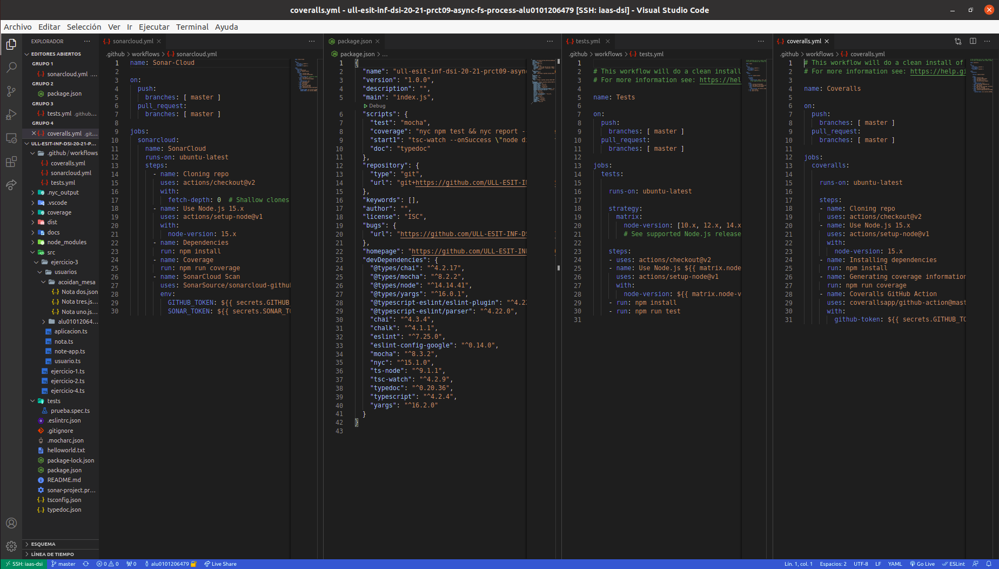

# Informe
## Práctica 9 - Sistema de ficheros y creación de procesos en Node.js
### Desarrollo de Sistemas Informáticos
### ACOIDAN MESA HERNANDEZ - alu0101206479@ull.edu.es


#### Introducción
Esto es un informe para poder llevar a cabo la **práctica 9 de Desarrollo de Sistemas Informáticos**, hemos vuelto a crear una estructura de directorios adecuada (algo que ya sabíamos de prácticas anteriores), añadiendole el uso del generador de documentación [TypeDoc](https://typedoc.org/) y el uso de [Mocha](https://mochajs.org/) (Marco de pruebas rico en funciones) con [Chai](https://www.chaijs.com/) (Librería de aserciones BDD / TDD para node y el navegador que se puede combinar con cualquier marco de pruebas JS o TS, en este caso lo hemos configurado con Mocha). También hemos añadido [Instanbul](https://istanbul.js.org/) (Una herramienta que permite obtener informes sobre el cubrimiento del código fuente llevado a cabo por las pruebas que haya diseñado), hemos aplicado la integración continua mediante [GitHub Actions](https://docs.github.com/en/actions) (permite crear flujos de trabajo que se pueden utilizar para compilar, probar y desplegar código, dando la posibilidad de crear flujos de integración y despliegue continuo dentro del propio repositorio de git) y hemos aplicado la comprobación de la calidad y seguridad del código fuente mediante [Sonar Cloud](https://sonarcloud.io/) (Plataforma de análisis de código continuo y online con la que puedes analizar tus proyectos y ver los resultados online en la nube) y GitHub Actions

Hemos vuelto a **trabajar con ficheros, a través de la [API de callbacks proporcionada por Node.js para interactuar con el sistema de ficheros](https://nodejs.org/dist/latest/docs/api/fs.html#fs_callback_api)**, a usar el paquete **[yargs](https://www.npmjs.com/package/yargs)** y hemos aprendido a trabajar con la **creación de procesos de Node.js, a través de la [API asíncrona proporcionada por Node.js para crear procesos](https://nodejs.org/dist/latest/docs/api/child_process.html#child_process_asynchronous_process_creation)**, en concreto, con la función [`spawn`](https://nodejs.org/dist/latest/docs/api/child_process.html#child_process_child_process_spawn_command_args_options). En este informe se mostrarán la resolución de los ejercicios y la explicación de estas soluciónes.

También cabe destacar que hemos usado de nuevo los [issues de Github](https://guides.github.com/features/issues/), ya que era por dónde único podríamos comunicarle al profesorado cualquier tipo de incidencia relacionada con la práctica.


#### Objetivos
Los objetivos de esta práctica han sido crear la estructura de directorios adecuada para trabajar, añadiendole el generador de documentación TypeDoc, el uso del marco de pruebas Mocha con la libreria Chai y Instanbul para obtener un informe de cubrimiento de nuestro código cada vez que ejecutasemos las pruebas.También debimos aplicar la integración continua mediante GitHub Actions y aplicar la comprobación de seguridad y calidad del código mediante SonarCloud y GitHub Actions, aparte de usar el paquete yargs de nuevo. Pero lo principal ha sido resolver los 4 ejercicios que nos planteaban en el [enunciado](https://ull-esit-inf-dsi-2021.github.io/prct09-async-fs-process/), para así familiarizarnos más profundamente con TypeScript, en concreto con el sistema de ficheros y con la creación de procesos.


#### Crear la estructura básica y adecuada del proyecto, añadiendole el generador de documentación TypeDoc, el uso del marco de pruebas Mocha con la librería Chai, la herramienta Instanbul, la aplicación de GitHub Actions y la aplicación de SonarCloud
Para crear la [estructura básica del proyecto](https://ull-esit-inf-dsi-2021.github.io/typescript-theory/typescript-project-setup.html), lo haremos como lo hicimos en prácticas anteriores (Estará el enlace al informe de esta en la bibliografía), también podemos pinchar el hiperenlace adjuntado que se encontrará disponible también en la bibliografía. También cabe destacar que todos los extras que le añadimos a la estructura básica los haremos como lo hicimos en la [práctica anterior](https://ull-esit-inf-dsi-2021.github.io/ull-esit-inf-dsi-20-21-prct08-filesystem-notes-app-alu0101206479/).

Finalmente, nos tiene que quedar algo parecido a lo siguiente (Se muestra a la izquierda la estructura y en el medio algunos archivos abiertos para que se vea su interior):




#### Ejercicios
En cuanto a los ejercicios que se mostrarán a continuación, podemos ver sus respectivos enunciados [en el enunciado de la práctica 9](https://ull-esit-inf-dsi-2021.github.io/prct09-async-fs-process/). El código fuente de estos ejercicios deberá estar alojado en un fichero independiente con nombre `ejercicio-n.ts` dentro del directorio `src/` de nuestro proyecto (Excepto el ejercicio 3, que estará en el directorio `ejercicio-3` dentro de `src/`).

Cabe destacar que también se debe aportar la documentación mediante el uso de TypeDoc.


##### Ejercicio 1
En este ejercicio disponiamos de un código de ejemplo el cual es el siguiente:

```typescript
import {access, constants, watch} from 'fs';

if (process.argv.length !== 3) {
  console.log('Please, specify a file');
} else {
  const filename = process.argv[2];

  access(filename, constants.F_OK, (err) => {
    if (err) {
      console.log(`File ${filename} does not exist`);
    } else {
      console.log(`Starting to watch file ${filename}`);

      const watcher = watch(process.argv[2]);

      watcher.on('change', () => {
        console.log(`File ${filename} has been modified somehow`);
      });

      console.log(`File ${filename} is no longer watched`);
    }
  });
}
```

Y debíamos realizar la traza de ejecución de dicho programa mostrando paso a paso el contenido de la pila de llamadas, el registro de eventos de la API y la cola de manejadores de Node.js, además de lo que se muestra por la consola. Y debíamos para ello simular que se llevan a cabo dos modificaciones del fichero helloworld.txt a lo largo de la ejecución del programa. Dicha traza la podremos ver comentada debajo del código en el siguiente enlace:

  [https://github.com/ULL-ESIT-INF-DSI-2021/ull-esit-inf-dsi-20-21-prct09-async-fs-process-alu0101206479/blob/master/src/ejercicio-1.ts](https://github.com/ULL-ESIT-INF-DSI-2021/ull-esit-inf-dsi-20-21-prct09-async-fs-process-alu0101206479/blob/master/src/ejercicio-1.ts)
  
En cuanto a la resolución de las preguntas que nos plantea el enunciado, las respuestas son las siguientes:

* ¿Qué hace la función access?
La función access prueba los permisos de un usuario para el archivo o directorio especificado en la ruta que se le pasa a la función

* ¿Para qué sirve el objeto constants?
El objeto constants sirve para realizar las operaciones del sistema de archivos, ya que contiene las constantes de uso común en estas. Por ejemplo, la constante F_OK (fs.constants.F_OK), sirve para comprobar en la función fs.access() que el archivo es visible para el proceso de llamada


##### Ejercicio 2
En este ejercicio disponiamos de un código de ejemplo el cual es el siguiente:


